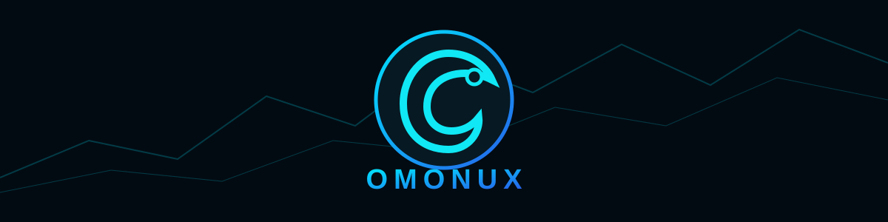

<div align="center">



# EMMANUEL OMONU
### AI Systems • Cybersecurity • Automation • Full-Stack Engineering

**Building intelligent, secure, and practical software from idea to production.**

[](https://github.com/omonux)
[](https://github.com/omonux/omonu-emmanuel)
[](https://github.com/omonux)
[](https://github.com/omonux)

</div>

---

## ⚡ What I Build

I build software at the intersection of **AI, automation, cybersecurity, and full-stack engineering** — with a focus on systems that are practical, secure, observable, and designed to evolve.

```text
IDEA
  ↓
ARCHITECTURE
  ↓
ENGINEERING
  ↓
SECURITY
  ↓
AI + AUTOMATION
  ↓
REAL-WORLD SOFTWARE
```

## 🚀 Flagship Project — OMONUX

**OMONUX** is an AI-assisted automated market-intelligence and trading platform built around controlled execution rather than letting an AI model directly make unrestricted exchange decisions.

```text
REAL-TIME MARKET DATA
        ↓
SIGNAL ENGINE
        ↓
AI ANALYSIS
(OpenAI + Gemini)
        ↓
RISK GUARDIAN
        ↓
EXECUTION
        ↓
POSITION MONITORING
        ↓
AUDIT TRAIL
```

### Core engineering areas

- Real-time market data and technical signals
- OpenAI and Google Gemini integrations
- Deterministic risk controls and position sizing
- Paper trading and exchange adapters
- Automated execution with explicit safety gates
- Authentication, encrypted credentials, rate limiting, and security headers
- Monitoring, notifications, and audit events

**Explore OMONUX →** https://github.com/omonux/omonu-emmanuel

> Trading software involves financial risk. OMONUX does not guarantee profits.

---

## 🛡️ Cybersecurity Mindset

Security is part of the architecture, not an afterthought.

- Secure API design
- Authentication and credential protection
- Web and application security
- Security automation
- OSINT and ethical security research
- Responsible AI integration
- Defensive engineering and risk controls

---

## 🧠 Technology Stack

| Area | Technologies |
|---|---|
| **Languages** | JavaScript · Python · HTML · CSS |
| **Backend** | Node.js · Express · REST APIs · WebSockets |
| **AI** | OpenAI APIs · Google Gemini APIs |
| **Automation** | Signal processing · workflow automation · scheduled systems |
| **Security** | API security · authentication · secure credential handling |
| **Trading** | Market data · paper trading · exchange adapters · risk controls |
| **Tools** | Git · GitHub · VS Code · Linux |

---

## 📌 Selected Work

### 🔹 OMONUX
AI-assisted market intelligence and automated trading infrastructure.

### 🔹 PhishGuard
Real-time URL security scanning and defensive cybersecurity tooling.

### 🔹 Web & Automation Projects
Full-stack applications, APIs, automation experiments, and practical developer tools.

---

## 📊 GitHub Activity

<div align="center">


</div>

---

## 🎯 Current Mission

**Build. Learn. Secure. Automate.**

I am continuously improving my engineering skills, exploring AI-powered systems, strengthening cybersecurity knowledge, and turning ambitious ideas into working software.

---

<div align="center">

### OMONUX
**Intelligence • Security • Automation • Engineering**

*Building systems that turn ideas into reality.*

</div>
